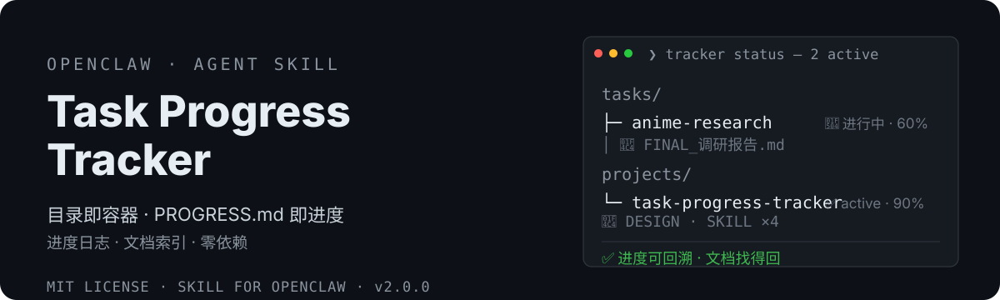

# OpenClaw Task Progress Tracker 🗂️

<div align="center">
  <strong>🇨🇳 中文</strong> | <a href="README.en.md">🌐 English</a>
</div>

<p align="center">
  
</p>

> 管理工作区 tasks/ 与 projects/ 目录的轻量进度卡系统——目录即容器，PROGRESS.md 即进度。
> OpenClaw task & project progress tracking — manage tasks/ and projects/ with PROGRESS.md cards: status + progress log + document index.


- 📚 **xiaoyaoclaw-kb-retriever**（知识库检索器）：本地知识库检索——分层 data_structure.md 索引导航 + 渐进式检索（md/pdf/xlsx），零依赖零 API key，Windows / macOS 双平台。<https://github.com/dtsola/xiaoyaoclaw-kb-retriever>
[](https://clawhub.ai/dtsola/skills/xiaoyaoclaw-task-progress-tracker)

## 为什么需要它

OpenClaw agent 每次会话都是全新启动。没有进度管理，你的工作会：
- ❌ **上下文丢失**：任务跨会话做到一半，下次接不上
- ❌ **文档散落**：报告和资料埋在随机文件夹，事后找不到
- ❌ **无法回溯**：上周这个任务做了什么？——没了
- ❌ **工具过重**：重型项目管理套件（CLI + 外部服务）对纯文件工作流是杀鸡用牛刀

这个 skill 一次性解决：**目录即容器 + PROGRESS.md 进度卡 + 文档索引**。

## 特性

- 📁 **双对象**：tasks（半小时~一周短期任务）+ projects（>一周时刻维护的长期项目）
- 🗂️ **目录即容器**：`tasks/<slug>/`、`projects/<slug>/` 本身就是任务/项目，不另起炉灶
- 📋 **PROGRESS.md 进度卡**：frontmatter（status/progress/docs）+ 只追加进度日志 + 文档索引
- 🔗 **文档索引**：机器可读（YAML docs 数组）+ 人可读（索引表格）双通道
- 🚦 **建项克制**：只响应明确指令，不做全局技能钩子（v1 教训）
- 🪶 **零依赖**：纯文件操作，无 CLI、无外部服务、无数据库
- 🏠 **三件套协同**：与 initializer（目录规范）、memory-distill（记忆蒸馏）无缝衔接

## 安装

```bash
# ClawHub（推荐）
clawhub install xiaoyaoclaw-task-progress-tracker

# 或从 GitHub 手动安装
git clone https://github.com/dtsola/xiaoyaoclaw-task-progress-tracker
# 把 SKILL.md 和 templates/ 放到你的 skills 目录
```

## 使用

1. 把 skill 放到 OpenClaw 的 skills 目录
2. 对 agent 说「**开个任务 xxx**」或「**建个项目 xxx**」，agent 会自动：建 `tasks/<slug>/` 或 `projects/<slug>/` 目录 + PROGRESS.md 卡片
3. 日常维护：说一句进度、挂个文档，agent 自动更新卡片；打开任何 PROGRESS.md 即可看到状态、时间线、文档索引

详细场景见 [USER_GUIDE.md](USER_GUIDE.md)（用户视角）。

## 🚀 快速上手（三步，5 分钟）

### Step 1：安装技能

```bash
clawhub install xiaoyaoclaw-task-progress-tracker
```

### Step 2：建第一个任务

对你的 agent 说：

> 开个任务：调研 XX

agent 自动完成：生成 slug → 建 `tasks/xx/` 目录 → 从模板创建 PROGRESS.md 卡片（status: active）→ 汇报路径。

### Step 3：日常维护

干活时说一句：

> 任务 xx 进度：资料收集完了，开始写报告

agent 自动追加进度日志 + 更新时间戳。报告出来了，再说一句「给任务 xx 挂个文档：FINAL_调研报告.md 是最终报告」，文档就进了索引，随时找得回。

### 日常使用习惯

| 场景 | 动作 |
|---|---|
| 开新任务 | 说「开个任务：xxx」 |
| 建长期项目 | 说「建个项目：xxx」 |
| 更新进度 | 说「任务 xxx 进度：…」 |
| 归档文档 | 说「给 xxx 挂个文档：<路径> <说明>」 |
| 盘点 | 说「现在有哪些任务/项目在跑？」 |
| 查进度 | 说「xxx 现在到哪了？」 |
| 完结 | 说「任务 xxx 完结」→ 标记 done + 记入当天日志 |

## 与其他方案的区别

| | v1（已废弃） | **xiaoyaoclaw-task-progress-tracker v2** |
|---|---|---|
| 状态载体 | PROGRESS.md 双轨制（状态层×内容层分离） | ✅ PROGRESS.md 唯一卡片（状态+日志+索引一体） |
| 建项触发 | 任何技能激活即建项（误报爆炸） | ✅ 用户明确指令 / 明确预期 |
| 文档管理 | 不管理 | ✅ docs/ 索引（cairn artifact 思想，无 CLI） |
| 依赖 | 无 | ✅ 无（保持轻量） |
| 外部服务 | 无 | ✅ 无（纯文件，真相源在工作区） |

## 目录结构

```
xiaoyaoclaw-task-progress-tracker/
├── SKILL.md                    # 技能主体（意图识别表 + 操作手册 + 边界）
├── templates/
│   ├── task-card.md            # 任务 PROGRESS.md 模板
│   └── project-card.md         # 项目 PROGRESS.md 模板
├── assets/readme/              # hero + 群二维码
├── DESIGN.md                   # 设计方案
├── USER_GUIDE.md               # 用户使用指南
├── README.md
└── LICENSE
```

## License

MIT — 随便用，署名可选。

---

## 🛠️ 需要定制？

**Agent & Skills 定制，价格 ¥800 起。**

- 微信：`dtsola`（添加好友时备注：**openclaw定制**）
- 服务范围：OpenClaw 多 agent 部署 / 工作区规范化 / 自定义 Skill 开发 / agent 记忆系统搭建

## 💬 加入交流群

小遥全系产品用户交流群——产品反馈 · 使用交流 · 功能建议：

<p align="center">
  
</p>

<p align="center">扫码加群，或添加微信 <code>dtsola</code>（备注：<b>加群</b>）</p>

## 姊妹项目

- 🏠 **xiaoyaoclaw-workspace-initializer**（工作区初始化器）：给每个 agent 一个「家」——标准目录结构 + WORKSPACE.md 规范 + 多 agent 配置安全。<https://github.com/dtsola/xiaoyaoclaw-workspace-initializer>
- 🧠 **xiaoyaoclaw-memory-distill**（记忆蒸馏）：把对话蒸馏成结构化记忆，解决上下文溢出。<https://github.com/dtsola/xiaoyaoclaw-memory-distill>
- 🩹 **xiaoyaoclaw-workspace-auditor**：工作区体检（只读审计），5 类检查 + 分级报告 + 修复建议，零依赖脚本永不改文件。<https://github.com/dtsola/xiaoyaoclaw-workspace-auditor>
- 📎 **xiaoyaoclaw-web-clipper**（网页剪藏）：把任意网页保存为带 frontmatter 的本地 Markdown——双引擎正文提取（readability + trafilatura 降级链）、中文文件名安全、批量剪藏 + 去重；输出直通 knowledge/clippings/，配合 kb-retriever 建索引即可检索。<https://github.com/dtsola/xiaoyaoclaw-web-clipper>
- 🤝 **xiaoyaoclaw-agent-orchestrator**（Agent 协作编排，**协作层**）：架在六件套之上——拆任务、分 agent、管进度、聚结果、失败重试。<https://github.com/dtsola/xiaoyaoclaw-agent-orchestrator>

## 